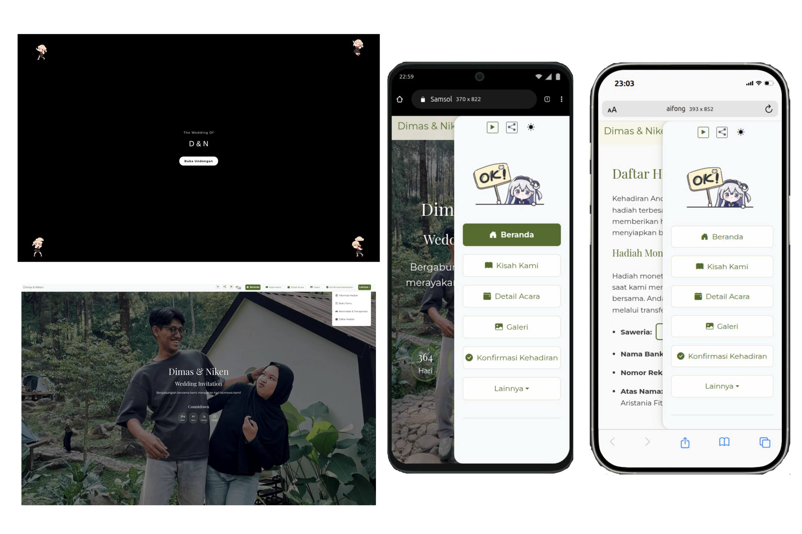

# Wedding Invitation

This is a digital wedding invitation app for Dimas & Niken, built with React, TypeScript, and Netlify Functions. The website is designed to be interactive, responsive, and user-friendly for all guests.
- **Screenshot:**

<p align="center">

</p>

## Table of Contents

- [Main Features](#main-features)
- [Languages & Frameworks](#languages--frameworks)
- [How to Download](#how-to-download)
- [How to Run](#how-to-run)
- [Deployment](#deployment)
- [Environment Configuration](#environment-configuration)
- [Troubleshooting](#troubleshooting)
- [Node.js Version](#nodejs-version)
- [Available Scripts](#available-scripts)
- [Contact Me](#contact-me)
- [License](#license)
- [Acknowledgements](#acknowledgements)


## Main Features

- **Cover Screen**: Personalized opening screen with guest name from URL.
- **Countdown**: Countdown timer to the wedding day.
- **Our Story**: The couple's journey and love story.
- **Event Details**: Information about time, location, and agenda.
- **Gallery**: Prewedding and special moment photos.
- **RSVP Confirmation**: Form for guests to confirm attendance, number of guests, and food preferences. Data is sent to Discord via Netlify Function.
- **Guest Book**: Guests can leave messages and wishes.
- **Gift Info & Registry**: Bank account, e-wallet, and gift registry information.
- **Accommodation & Transportation**: Hotel and transport recommendations for out-of-town guests.
- **Scroll to Top Button**: Easy navigation to the top of the page.
- **Modern UI & Animation**: Uses AOS, Bootstrap, and custom CSS.
- **Gemini AI Chat**: Floating Gemini icon with AI chat bubble, allowing guests to ask questions about the wedding invitation and get instant answers powered by Google Gemini AI.


## Languages & Frameworks

- TypeScript
- React
- Node.js (Netlify Functions)
- Bootstrap 5 & Bootstrap Icons
- AOS (Animate On Scroll)
- Slick Carousel (for gallery)


## How to Download

You can download or clone this repository using Git:

**Linux / macOS:**
```bash
git clone https://github.com/jimbon25/wedding-invitation.git
```

**Windows (Command Prompt or PowerShell):**
```powershell
git clone https://github.com/jimbon25/wedding-invitation.git
```

Or, click the green "Code" button on GitHub and choose "Download ZIP" to get the source files directly.


## How to Run

1. Clone this repository
2. Install dependencies:
   ```bash
   npm install
   ```
3. Start development mode:
   ```bash
   npm start
   ```
4. Open in browser: [http://localhost:3000](http://localhost:3000)


## Deployment


### Netlify
1. Make sure you have a Netlify account.
2. Click "New site from Git" and connect to this repository.
3. Set the environment variable `DISCORD_WEBHOOK_URL` in the Netlify dashboard.
4. Build command: `npm run build`, publish directory: `build`.
5. Deploy and your app is ready to use.

### Vercel
1. Make sure you have a Vercel account and your repo is pushed to GitHub.
2. Import the project from GitHub to Vercel.
3. Set the environment variable `DISCORD_WEBHOOK_URL` in the Vercel dashboard (Project Settings > Environment Variables).
4. Build command: `npm run build`, output directory: `build`, install command: `npm install`.
5. Make sure the `node-fetch` dependency in package.json is version 2.x (already set if you use this repo).
6. Deploy and your app is ready to use.

> **Note:**
> - The Discord webhook endpoint will automatically adjust (Netlify/Vercel) without any code changes needed.
> - If you get a 500 error on Vercel, make sure the environment variable and dependency are correct.


## Environment Configuration

Add a `.env` file in the project root for the Discord webhook:
```
DISCORD_WEBHOOK_URL=your_webhook_url
```


## Troubleshooting

- **RSVP/Guest Book not sent to Discord:**
  - Make sure the `DISCORD_WEBHOOK_URL` environment variable is set and correct in the Netlify dashboard.
  - Ensure your Discord webhook is still active and not deleted.
  - Check Netlify Functions logs for detailed errors.

- **Build failed on Netlify:**
  - Make sure all dependencies are installed correctly.
  - Check the Node.js version used on Netlify and match it with your project's supported version.

- **App is not accessible:**
  - Make sure your Netlify domain is active and there are no DNS issues.
  - Check Netlify logs for runtime errors.

- **Images, music, or videos not showing:**
  - Make sure the files exist in the `public/` folder and the paths are correct in your code.


## Node.js Version

Recommended Node.js versions: **16.x**, **18.x**, or **20.x**

Make sure your local and Netlify environment use one of these versions for best compatibility.


## Available Scripts

In the project directory, you can run:

### `npm start`

Runs the app in the development mode.\
Open [http://localhost:3000](http://localhost:3000) to view it in the browser.

The page will reload if you make edits.\
You will also see any lint errors in the console.

### `npm test`

Launches the test runner in the interactive watch mode.\
See the section about [running tests](https://facebook.github.io/create-react-app/docs/running-tests) for more information.

### `npm run build`

Builds the app for production to the `build` folder.\
It correctly bundles React in production mode and optimizes the build for the best performance.

The build is minified and the filenames include the hashes.\
Your app is ready to be deployed!

See the section about [deployment](https://facebook.github.io/create-react-app/docs/deployment) for more information.

### `npm run eject`

**Note: this is a one-way operation. Once you `eject`, you can’t go back!**

If you aren’t satisfied with the build tool and configuration choices, you can `eject` at any time. This command will remove the single build dependency from your project.

Instead, it will copy all the configuration files and the transitive dependencies (webpack, Babel, ESLint, etc) right into your project so you have full control over them. All of the commands except `eject` will still work, but they will point to the copied scripts so you can tweak them. At this point you’re on your own.

You don’t have to ever use `eject`. The curated feature set is suitable for small and middle deployments, and you shouldn’t feel obligated to use this feature. However we understand that this tool wouldn’t be useful if you couldn’t customize it when you are ready for it.

## Learn More


You can learn more in the [Create React App documentation](https://facebook.github.io/create-react-app/docs/getting-started).

To learn React, check out the [React documentation](https://reactjs.org/).

---
## Contact Me

- GitHub: [jimbon25](https://github.com/jimbon25)
- Instagram: [@dimasladty](https://instagram.com/dimasladty)
- Facebook: [Dimas LA](https://facebook.com/iv.dimas)


## License

This project is licensed under the MIT License. See the LICENSE file for details.

## Acknowledgements

- [React](https://reactjs.org/)
- [Create React App](https://create-react-app.dev/)
- [Bootstrap](https://getbootstrap.com/)
- [Bootstrap Icons](https://icons.getbootstrap.com/)
- [AOS (Animate On Scroll)](https://michalsnik.github.io/aos/)
- [Slick Carousel](https://kenwheeler.github.io/slick/)
- [Netlify](https://www.netlify.com/)
- [Discord](https://discord.com/)
